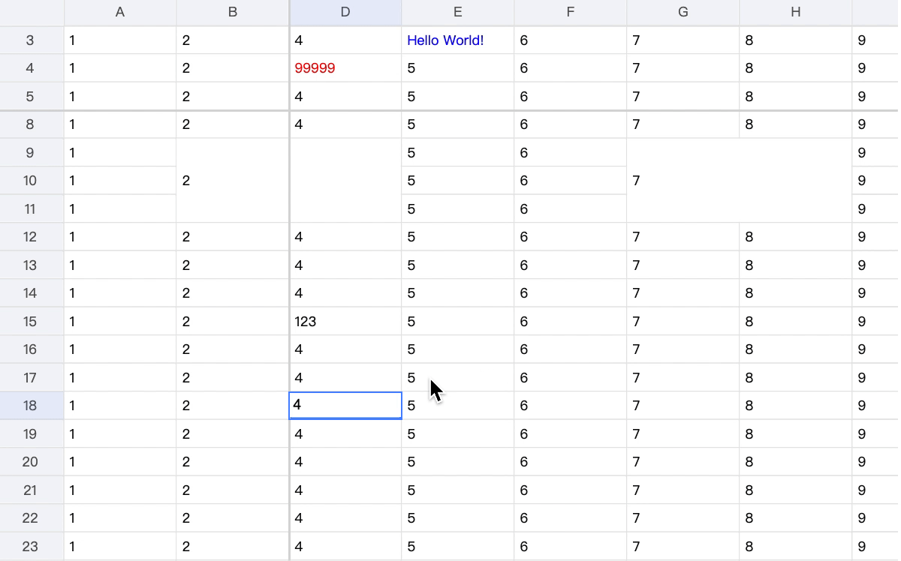
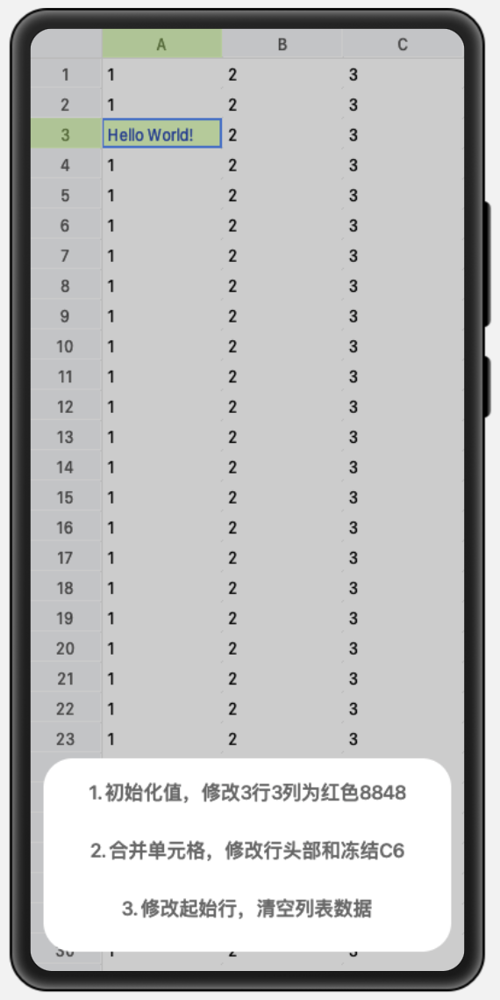
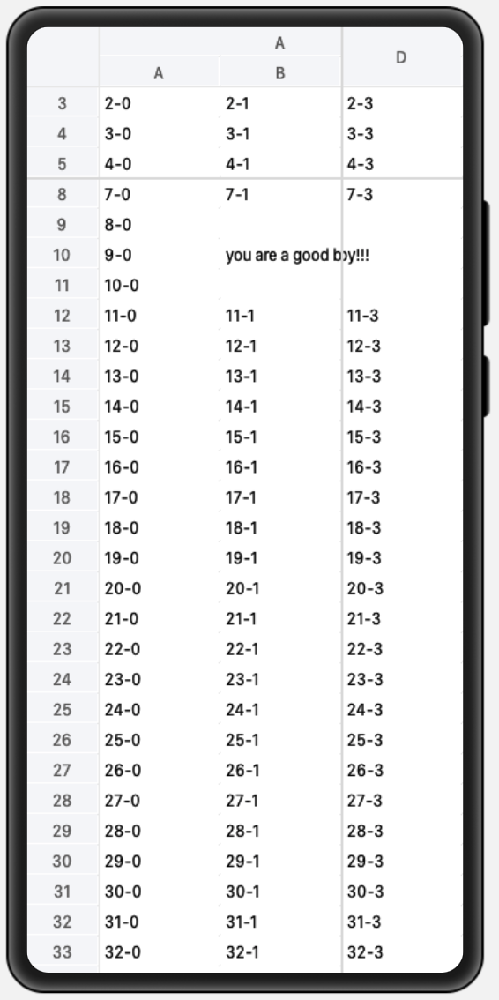
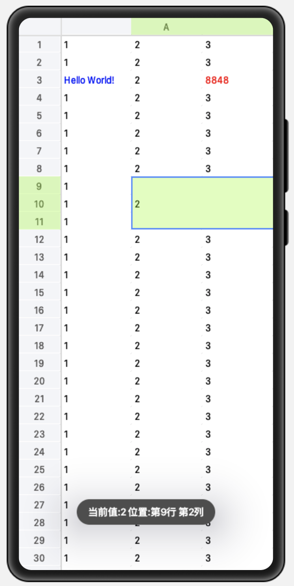
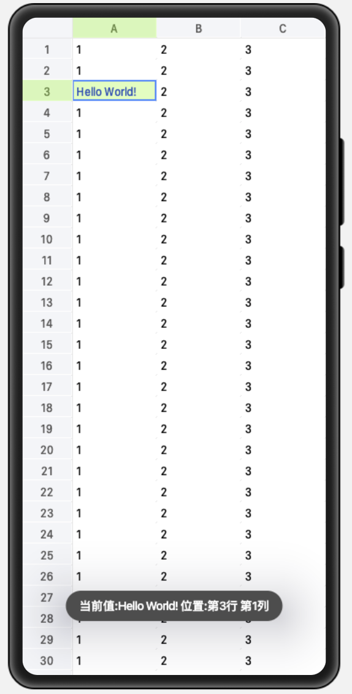

# OpenHarmonySheet

基于 Canvas 实现的高性能 Excel 表格引擎组件 [OpenHarmonySheet](https://github.com/Wscats/sheet)。



在项目中引入 `<Sheet></Sheet>` 组件即可，使用方法如下：

```html
<element name="Sheet" src="./sheet//pages//index/index.hml"></element>
<div class="container">
  <Sheet></Sheet>
</div>
```

# API 接口

提供完整的表格操作接口，例如：可修改单元格数据，样式，行列高度:

- scrollRows
- scrollCols
- cell
- row
- cellStyle
- freeze
- merges
- colHeader
- render
- selection
- onClick
- onSelected
- focus
- selectionStyle
- headerCellStyle
- freezeLineStyle
- headerLineStyle
- target
- scrollCols
- scrollRows
- startCol
- startRow

单元格接口:

```js
cell: {
    text: '',
    style: { border, fontSize, fontName, bold, italic, color, bgcolor, align, valign, underline, strike, textwrap, padding },
    type: text | button | link | checkbox | radio | list | progress | image | imageButton | date
}
```

# 效果






# 开发

本项目基于 OpenHarmony 下的 JavaScript UI 框架，运行环境**请参考 [OpenHarmony 项目配置方法](https://gitee.com/isrc_ohos/ultimate-harmony-reference/blob/master/OpenHarmony%20JS%E9%A1%B9%E7%9B%AE%E5%BC%80%E5%8F%91%E6%B5%81%E7%A8%8B.md) 进行项目配置和运行。**

如果你不熟悉 OpenHarmony 的 JS 开发，**请参考该[官方文档](https://developer.harmonyos.com/cn/docs/documentation/doc-references/js-apis-overview-0000001056361791)。**

# 运行

1. 下载 [OpenHarmonySheet](https://github.com/Wscats/sheet) 项目工程，将工程导入 DevEco Studio 进行编译构建及运行调试。
2. 进行编译构建，生成一个 HAP 应用安装包，生成 HAP 应用安装包。
3. 安装运行后，即可在设备上查看应用示例运行效果，以及进行相关调试。

# 鸣谢

- [X Spreadsheet](https://github.com/myliang/x-spreadsheet)
- [Tencent Doc](https://docs.qq.com)
