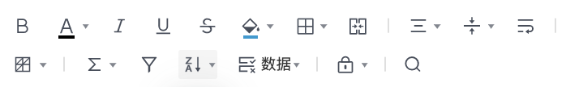
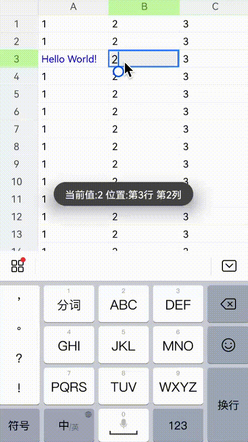
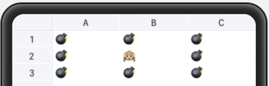
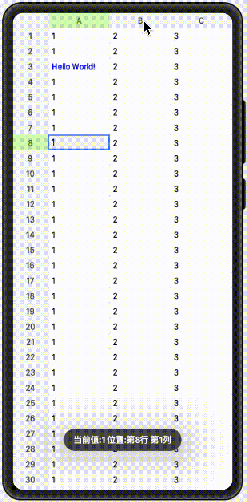

# OpenHarmonySheet

基于 `Canvas` 实现的高性能 `Excel` 表格引擎组件 [OpenHarmonySheet](https://github.com/Wscats/sheet)。

由于大部分前端项目渲染层是使用框架根据排版模型树结构逐层渲染的，整棵渲染树也是与排版模型树一一对应。因此，整个渲染的节点也非常多。项目较大时，性能会受到较大的影响。

为了提升渲染性能，提供更优质的编辑体验从 `DOM` 更换成 `Canvas` 渲染，方便开发者构建重前端大型在线文档项目，在国内外实现类似引擎的公司仅仅只有几家，如：腾讯文档，金山文档和谷歌文档等。


在项目中引入 `<Sheet></Sheet>` 组件即可，使用方法如下：

```html
<element name="Sheet" src="../../components/index.hml"></element>

<Sheet
  sheet="{{sheet}}"
  @sheet-show="sheetShow"
  @sheet-hide="sheetHide"
  @click-cell-start="clickCellStart"
  @click-cell-end="clickCellEnd"
  @click-cell-longpress="clickCellLongpress"
  @change="change"
></Sheet>
```

# 生命周期和事件

- sheet 表格数据
- @sheet-show 表格显示
- @sheet-hide 表格隐藏
- @click-cell-start 单元格点击前
- @click-cell-end 单元格点击后
- @click-cell-longpress 长按表格
- @change 修改单元格数据

比如，我们在示例中可以监听 `长按` 事件，当用户 `长按` 的时候弹出 `对话框`，示例代码如下：

```ts
clickCellLongpress(evt) {
    prompt.showDialog({
        buttons: [{
            text: '测试',
            color: '#666666',
        }],
    });
}
```

以上所有的接口都会返回一个详细的 `sheet` 对象，里面含有以下信息：

- el 表格的节点
- textarea 单元格输入框节点
- viewport 单元格高亮选框
- table 单元格操作对象

```ts
sheetShow(sheet) {
    this.el = sheet.detail.el;
    this.textarea = sheet.detail.textarea;
    this.viewport = sheet.detail.viewport;
    this.table = sheet.detail.table;
}
```

# API 接口

渲染引擎封装好了常用的表格数据操作等接口。

- `this.table.xxx`

用于帮助你操作单元格的所有数据和格式，也极大方便你自定义一个功能完整的工具栏：



- `this.viewport.xxx`

用于帮助你操作单元格上层的高亮选框。

- `this.textarea.xxx`

`this.textarea` 是对鸿蒙的原生 `<textarea>` 组件的封装接口，用于帮助你接受用户在界面中的输入，然后配合 `this.table.xx` 将数据层的数据渲染到表格渲染层，这里的输入需要真机调试，因为真机有自带输入法，实测 `Previewer` 无效。



## 初始化表格渲染层

```ts
import Table from "./sheet/";
this.el = this.$refs.canvas;
this.table = Table.create(this.el, 850, 800).render();
```

## 初始化选区层

`viewport` 用于创建和控制单元格高亮选框，绘制在单元格上层，输入框下层，支持列选择，行选择和范围选择。

```ts
this.viewport = new Viewport(this.table).render();
```

## 初始化表格数据

在任何情况，你都可以使用 `.cell` 方法全局更新任一位置的数据。

```ts
this.table.cell((ri, ci) => `${ri}-${ci}`).render();
```

## 合并单元格

在表格中这是一个常用的方法，我们可以打碎局部单元格做合并操作。

```ts
this.table.merges(["G9:H11", "B9:D11"]).render();
```

## 设置列表行头

可以设置你的列表行头和其高度。

```ts
this.table.colHeader({ height: 50, rows: 2 }).render();
```

## 冻结区域

某些情况，我们在查阅表格的时候，我们可能需要固定某些行和某些列的单元格来提高表格阅读性，此时 `.freeze` 就可以派上用场。

```ts
this.table.freeze("C6").render();
```

## 滚动区域

一般配合冻结区域使用，让冻结区域以外的选区可以做滚动操作。

```ts
this.table.scrollRows(2).scrollCols(1).render();
```

## 设置选区

非特殊情况你不需要花费时间去操作单元格选框，正常情况选框接受你单元格的相对位置来绘制。

```ts
const range = this.viewport.range(
  evt.changedTouches[0].localX,
  evt.changedTouches[0].localY
);
this.table.selection(range);
this.viewport.render(this.table.$draw);
```

## 单元格，行和列接口

单元格，行和列表格结构如下：

|        |             |             |
| ------ | ----------- | ----------- |
|        | col 列      | col 列      |
| row 行 | cell 单元格 | cell 单元格 |
| row 行 | cell 单元格 | cell 单元格 |

我们可以使用以下方法更新单元格第二行第二列的数据为 `8848`，颜色为红色：

```ts
this.table
  .cell((ri, ci) => {
    if (ri === 2 && ci === 2) {
      return {
        text: "8848",
        style: {
          color: "red",
        },
      };
    }
    return this.sheet?.[ri]?.[ci] || "";
  })
  .render();
```

当然你可以精心定制每一个单元格的数据，这些数据可以来自于你的后端服务器，也可以来自于客户端的输入，配合客户端和服务端的存储能力，将数据持久化保存。

```ts
this.sheet = [
  ["💣", "💣", "💣"],
  ["💣", "🙉", "💣"],
  ["💣", "💣", "💣"],
];
this.table.cell((ri, ci) => this.sheet?.[ri]?.[ci] || "").render();
```



如果想操作更多单元格，行和列的数据和样式结构，比如行高度，列高度，单元格边框，字体排版，内外边距，下划线，背景色和旋转角度等，具体可以参考以下接口，支持各种丰富的多样的改动：

```ts
{
  row: { height, hide, autoFit },
  col: { width, hide, autoFit },
  cell: {
    text,
    style: {
      border, fontSize, fontName,
      bold, italic, color, bgcolor,
      align, valign, underline, strike,
      rotate, textwrap, padding,
    },
    type: text | button | link | checkbox | radio | list | progress | image | imageButton | date,
  }
}
```

## 其他接口

除此之外还提供其他完整的表格操作接口等待你的探索:

- scrollRows
- scrollCols
- cell
- row
- cellStyle
- freeze
- merges
- colHeader
- render
- selection
- onClick
- onSelected
- focus
- selectionStyle
- headerCellStyle
- freezeLineStyle
- headerLineStyle
- target
- scrollCols
- scrollRows
- startCol
- startRow

# 效果演示

我们将上面常见的接口做了一些演示，运行 [OpenHarmonySheet](https://github.com/Wscats/sheet)，`长按`任一单元格弹出`对话框`并点击对应选项即可查看常用接口的运行结果，此演示仅供参考，更多实际使用场景请参考文档实现:




# 实现方案

在谈谈实现方案之前，**我们先讲讲表格渲染有多复杂**，表格的渲染一般来说有两种实现方案：

- `DOM` 渲染。
- `Canvas` 渲染。

业界比较出名的 `handsontable` 开源库就是基于 `DOM` 实现渲染，同等渲染结果，需要对 `DOM` 节点进行精心的设计与构造，但显而易见十万、百万单元格的 `DOM` 渲染会产生较大的性能问题。因此，如今很多在线表格实现都是基于 `Canvas` 和叠加 `DOM` 来实现的，但使用 `Canvas` 实现需要考虑可视区域、滚动操作、画布层级关系，也有 `Canvas` 自身面临的一些性能问题，包括 `Canvas` 如何进行直出等，对开发的要求较高，但为了更好的用户体验，更倾向于 `Canvas` 渲染的实现方案。

我们通过分类收集视图元素，再进行逐类别渲染的方式，减少 `Canvas` 绘图引擎切换状态机的次数，降低性能损耗，优化渲染耗时。

| 顶层 |        |                  |
| ---- | ------ | ---------------- |
| ↑    | DOM    | 容器插件输入框等 |
| ↑    | Canvas | 高亮选区等       |
| ↑    | Canvas | 内容字体背景色等 |
| 底层 |        |                  |

# 开发

本项目基于 `OpenHarmony` 下的 `JavaScript UI` 框架，运行环境**请参考 [OpenHarmony 项目配置方法](https://gitee.com/isrc_ohos/ultimate-harmony-reference/blob/master/OpenHarmony%20JS%E9%A1%B9%E7%9B%AE%E5%BC%80%E5%8F%91%E6%B5%81%E7%A8%8B.md) 进行项目配置和运行。**

如果你不熟悉 `OpenHarmony` 的 `JavaScript` 开发，**请参考该[官方文档](https://developer.harmonyos.com/cn/docs/documentation/doc-references/js-apis-overview-0000001056361791)。**

# 运行

1. 下载 [OpenHarmonySheet](https://github.com/Wscats/sheet) 项目工程，将工程导入 `DevEco Studio` 进行编译构建及运行调试。
2. 进行编译构建，生成一个 `HAP` 应用安装包，生成 `HAP` 应用安装包。
3. 安装运行后，即可在设备上查看应用示例运行效果，以及进行相关调试。

# 鸣谢

- [X Spreadsheet](https://github.com/myliang/x-spreadsheet)
- [Tencent Doc](https://docs.qq.com)
